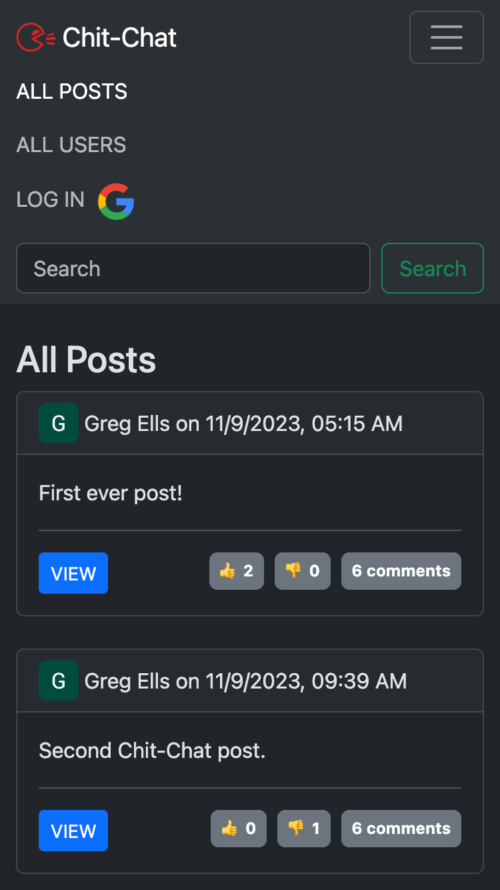
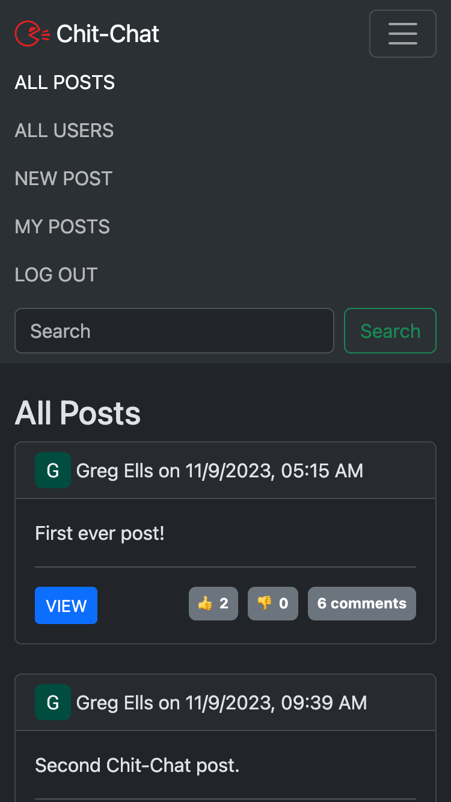
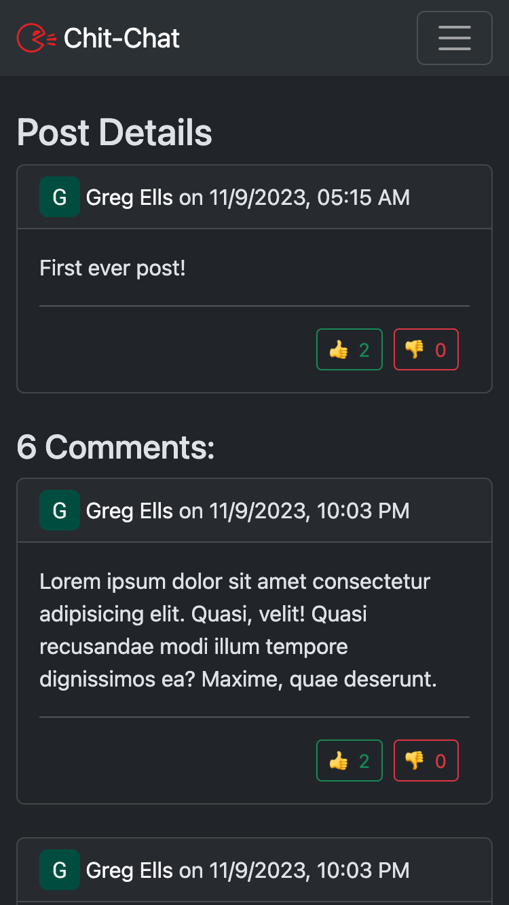
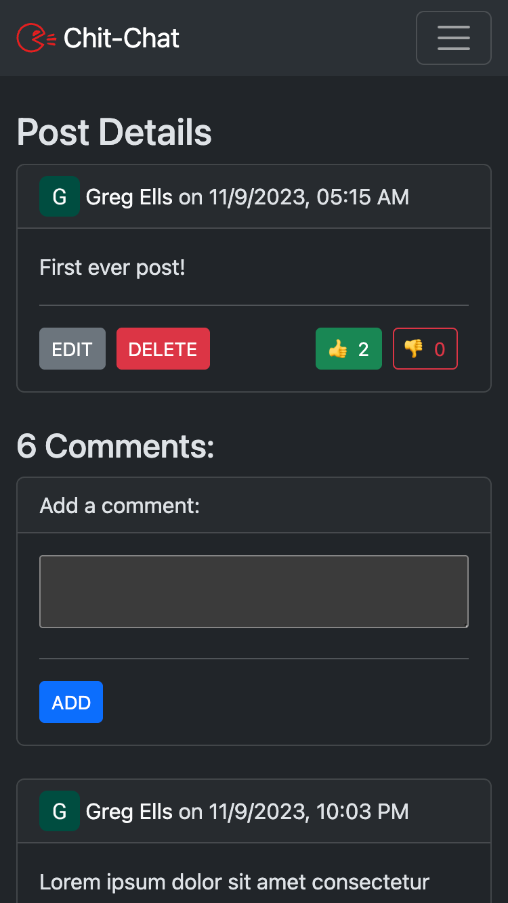
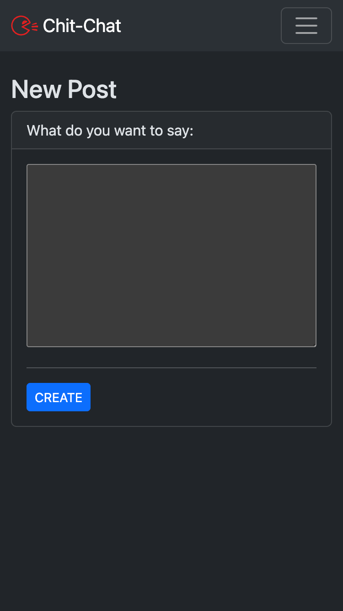
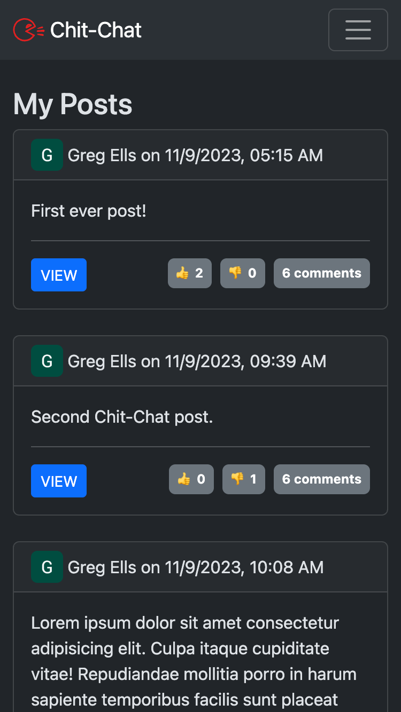
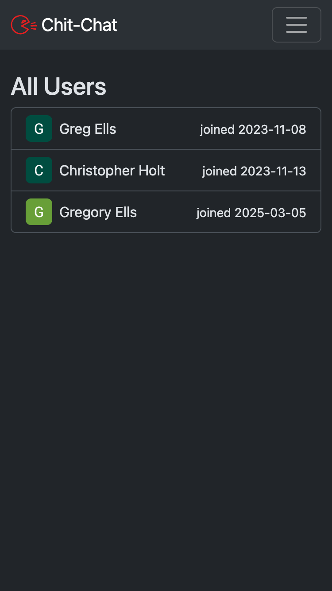
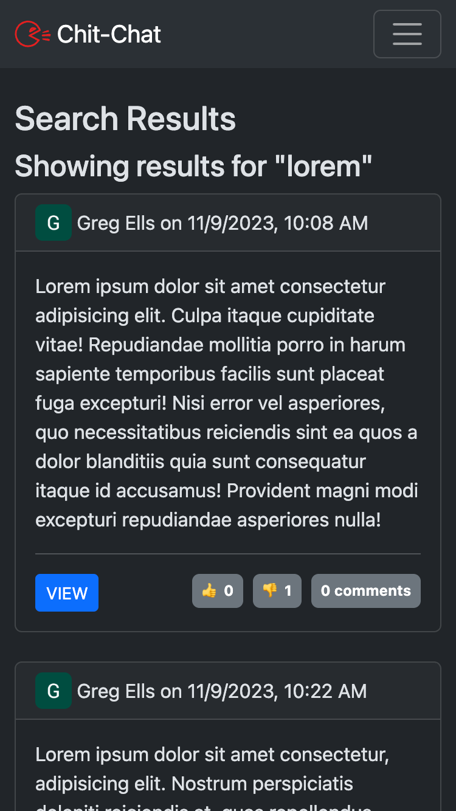

# Chit-Chat
This project is a Twitter-like app where users can make posts, comment on posts, and thumbs-up/thumbs-down posts and comments.

Visitors to the site may browse posts and comments without signing in.

To create, edit, delete, or vote on posts and comments, users must sign-in using a Google account.

## Screenshots:
<!--  -->
|  |  |  |
|:---:|:---:|:---:|
| Home Page | Navbar - Visitors | Navbar - Users |
<!-- | Home Page | Navbar - Visitors | Navbar - Users | -->
<!-- | test | test | test | -->
<!-- | Home Page | Navbar - Visitors | Navbar - Users | -->
<!-- | Home Page&nbsp;&nbsp;&nbsp;&nbsp;&nbsp;&nbsp;&nbsp; | Navbar - Visitors | Navbar - Users&nbsp;&nbsp;&nbsp; | -->

|  |  |  |
|:---:|:---:|:---:|
| Post - Visitors | Post - Users | New Post |

|  |  |  |
|:---:|:---:|:---:|
| My Posts | All Users | Search |

<!-- |  |  |  |
|:---:|:---:|:---:|
| Home Page | Navbar - Visitors | Navbar - Users |

|  |  |  |
|:---:|:---:|:---:|
| Post - Visitors | Post - Users | New Post |

|  |  |  |
|:---:|:---:|:---:|
| My Posts | All Users | Search | -->

## Technologies Used:
* Node.js: the app is built using a Node.js server.
* Express: the server uses the Express framework.
* MongoDB: data is persisted to a MongoDB database.
* Mongoose: the database is interacted with using the Mongoose library.
* OAuth: authentication is provided by Google's OAuth API via the Passport library.
* CSS: the styling is achieved using the Bootstrap CSS framework.
* Heroku: the live website is hosted on Heroku.
* Atlas: the database is hosted on MongoDB's Atlas service.

## Getting Started:
[Try the live website here.](https://chit-chat-5142bec3ce1d.herokuapp.com/)

The project was planned out in a Trello board, view it on Trello [here.](https://trello.com/b/4HMmkMu4/chit-chat-project-planning)

The Entity Relationship Diagram (ERD) was made using Lucid Chart and can be seen in the Trello board.

Wireframes of the various pages were made using XXX and can be seen in the Trello board.

## Future Development Plans:
* Expand search functionality to include comments and user names.
* Add ability to sort posts by thumbs-up, thumbs-down, newer, older.
* Add ability to see edit history of posts & comments.

## Known Bugs:
No known bugs at this time.